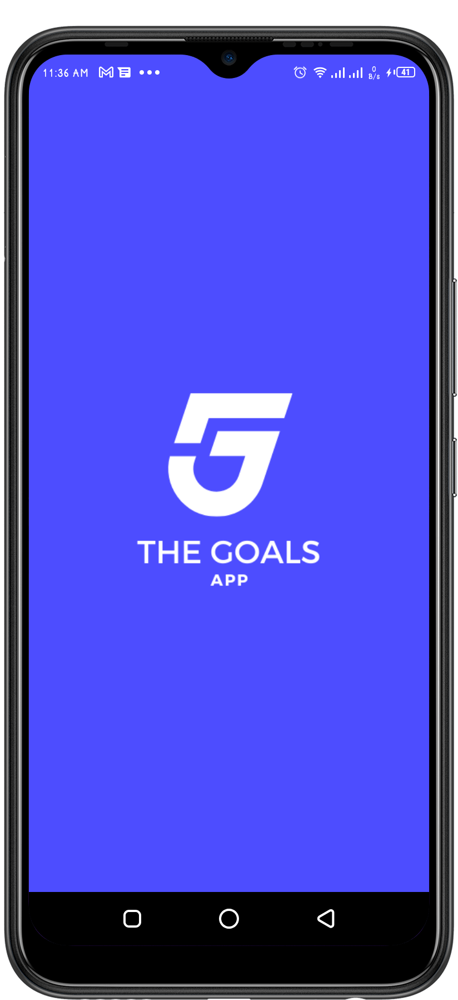
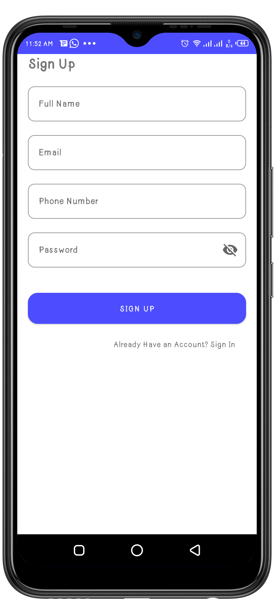
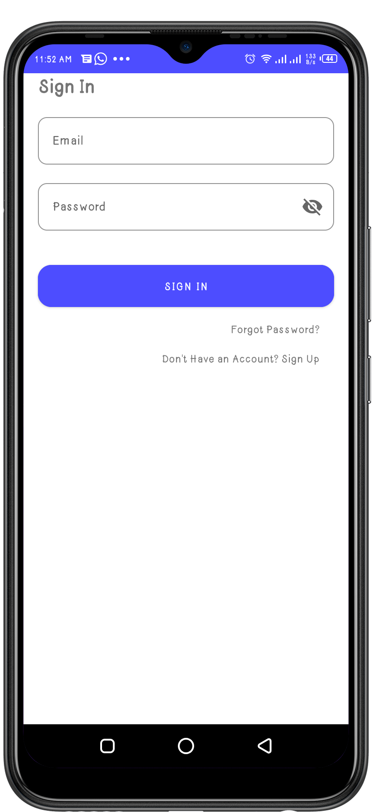
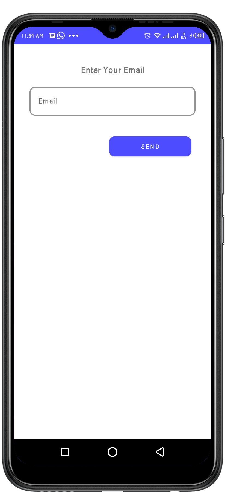
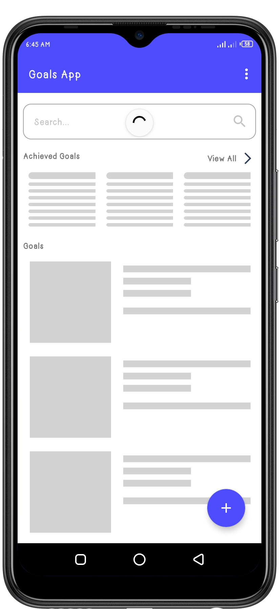
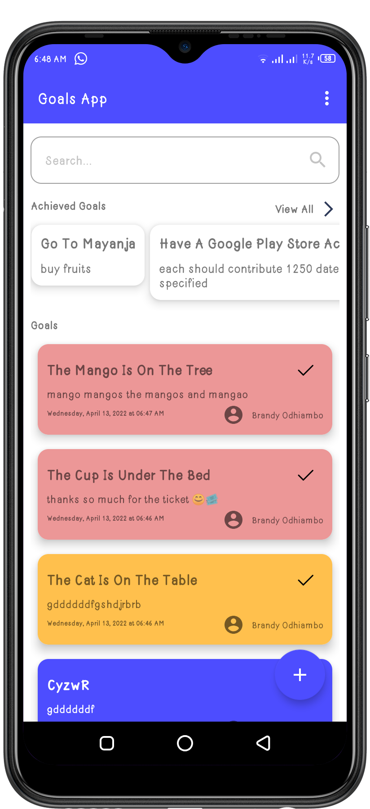
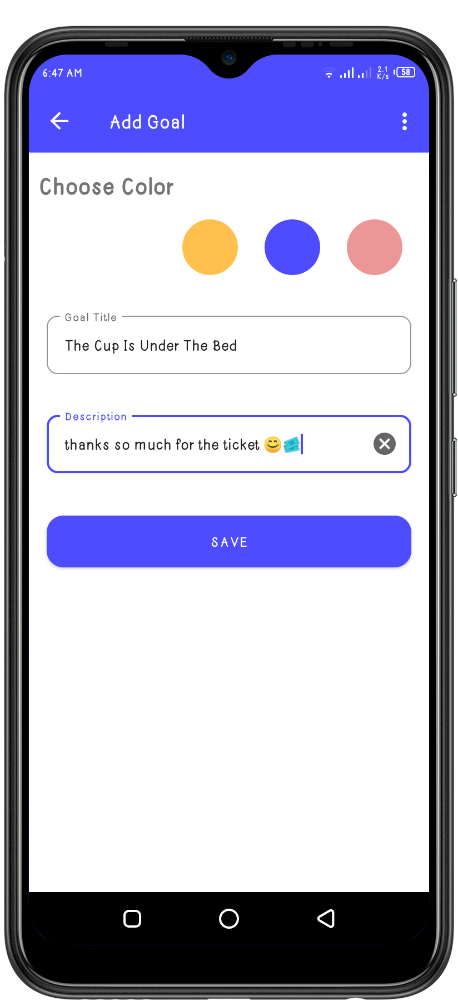
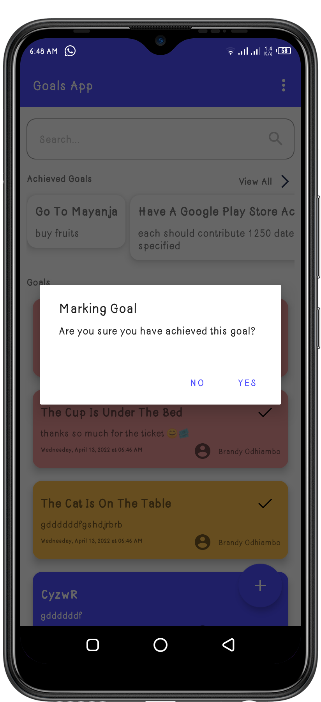
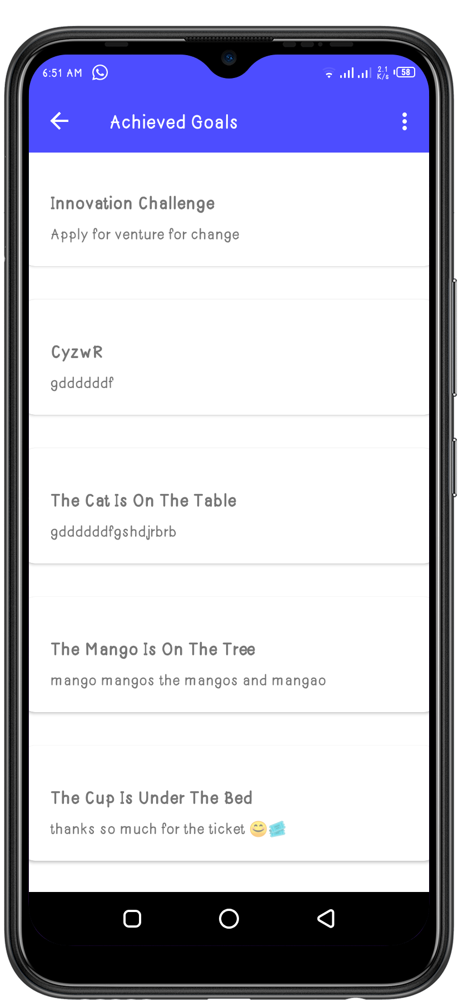

# The Goals App
An Android app built with Kotlin, Which helps individuals to keep tracks of there daily activities.It is built with the MVVM pattern and the latest Jetpack components. Firebase as the backend

# Splash

### Authentication
   

### Normal User
    

## Tech Stack.
- [Kotlin](https://developer.android.com/kotlin) - Kotlin is a programming language that can run on JVM. Google has announced Kotlin as one of its officially supported programming languages in Android Studio; and the Android community is migrating at a pace from Java to Kotlin
- [Android KTX](https://developer.android.com/kotlin/ktx.html) - Provide concise, idiomatic Kotlin to Jetpack and Android platform APIs.
- [AndroidX](https://developer.android.com/jetpack/androidx) - Major improvement to the original Android [Support Library](https://developer.android.com/topic/libraries/support-library/index), which is no longer maintained.
- [Lifecycle](https://developer.android.com/topic/libraries/architecture/lifecycle) - Perform actions in response to a change in the lifecycle status of another component, such as activities and fragments.
- [Viewmodel](https://developer.android.com/topic/libraries/architecture/viewmodel) -The ViewModel class is designed to store and manage UI-related data in a lifecycle conscious way
- [LiveData](https://developer.android.com/topic/libraries/architecture/livedata) -  A lifecycle-aware data holder with the observer pattern
- [Kotlin Coroutines](https://developer.android.com/kotlin/coroutines) - A concurrency design pattern that you can use on Android to simplify code that executes asynchronously.
- [Kotlinx Coroutines](https://github.com/Kotlin/kotlinx.coroutines) - Library support for Kotlin coroutines with multiplatform support.
- [View Binding](https://developer.android.com/topic/libraries/data-binding/) - Allows you to bind UI components in your layouts to data sources in your app using a declarative format rather than programmatically.
- [Hilt](https://developer.android.com/training/dependency-injection/hilt-android) -  A dependency injection library for Android that reduces the boilerplate of doing manual dependency injection in your project
- [Navigation Components](https://developer.android.com/guide/navigation/navigation-getting-started) -  Helps you implement navigation, from simple button clicks to more complex patterns, such as app bars and the navigation drawer.
- [Material Libarary](https://material.io/develop/android) -  Modular and customizable Material Design UI components for Android
- [Timber](https://github.com/JakeWharton/timber)- A logger with a small, extensible API which provides utility on top of Android's normal Log class.
- [SafeApiCall](https://github.com/JoelKanyi/Savings-Zetu-App/blob/main/app/src/main/java/com/kanyideveloper/savingszetu/utils/ExtensionFunctions.kt) Making safe Firebase network calls
- [Firebase Functions](https://firebase.google.com/docs/functions) - Cloud Functions for Firebase is a serverless framework that lets you automatically run backend code in response to events triggered by Firebase features and HTTPS requests.
- [Firebase Database](https://firebase.google.com/docs/database) - Store and sync data with our NoSQL cloud database. Data is synced across all clients in realtime, and remains available when your app goes offline.
- [Firebase Authentication](https://firebase.google.com/docs/auth) - Firebase Authentication provides backend services, easy-to-use SDKs, and ready-made UI libraries to authenticate users to your app.

## Setup Requirements
- Android device or emulator
- Android Studio
- Create your own Firebase project and replace the `google-services.json` with yours.
- Also create an app in the Safaricom Developers portal and use your own `SECRET_KEY` and `CONSUMER_KEY`

## Getting Started
In order to get the app running yourself, you need to:

1.  Clone this project
2.  Import the project into Android Studio
3.  Connect your android device with USB or just start your emulator
4.  After the project has finished setting up it stuffs, click the run button

## Support
- Found this project useful ❤️? Support by clicking the ⭐️ button on the upper right of this page. ✌️
- Notice anything else missing? File an issue
- Feel free to contribute in any way to the project from typos in docs to code review are all welcome.
